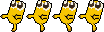
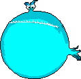

**MINIONS**

**Giới thiệu**

- Họ và tên : Lê Chí Anh Tuấn
- MSSV : 23020703
- Lớp K68J, Trường Đại học Công nghệ, Đại học Quốc gia Hà Nội (UET-VNU)

Minions là trò chơi điều khiển nhân vật Minion, giúp nhân vật sống sót qua 100 năm khỏi những quái vật khác. Tuy Minion nhỏ nhưng lại có võ, tuy nhỏ nhất không ăn được quái vật nào nhưng Minion lại có skill bá đạo tên là “Follow Boss”, skill giúp cho Minion theo sau và điều khiển quái vật mình đã chọn.

**Hướng dẫn tải và chạy game**

- Bước 1: Bấm vào phần "Code" màu xanh lá ở trên rồi bấm "Download ZIP" ở dưới cùng để tải game, hoặc có thể kéo code về từ trên github.
- Bước 2: Extract file zip vừa tải về
- Bước 3: Bấm vào file main.exe để chơi game

**Mô tả về game**

**Gameplay :** xem gameplay của game tại đây [ LTNC - K68J - Lê Chí Anh Tuấn - 23020703 - Game Minions (youtube.com)](https://www.youtube.com/watch?v=JXFI7sBAq9g)

### **Control**

- Game có những tác vụ di chuyển lên xuống trái phải và sử dụng skill của Minion.

  Là các nút di chuyển Minion lên, xuống, trái, phải.
  
 Sử dụng TAB để có thể sử dụng skill của Minion và chọn quái vật mình muốn theo. 

Sử dụng Q để thoát giao diện khi sử dụng skill hoặc không muốn điều khiển quái vật mình đã chọn nữa.
### **CÁC THÀNH PHẦN TRONG GAME**

- Minion: Chính là nhân vật bạn điều khiển, gồm hình ảnh Minion vẫy đuôi dễ thương.
  
  
- Threat: là quái vật Blue Fish (con quái vật màu xanh dương) có level là 10.
  
  
- ThreatRedFish: là quái vật Red Fish (con quái vật màu đỏ, cắn cạp cạp) có level là 5.
  
  
- ThreatBigFish: là quái vật Big Fish (con quái vật to nhất màu nâu) có level là 100.
  
  

- YEAR, LEVEL, COOLDOWN: là năm, level và thời gian hồi chiêu của Minion. Năm sẽ tăng mỗi 5s bắt đầu với năm 0, level của Minion sẽ tăng 2 level mỗi năm hoặc theo số lượng quái vật mà Minion tiêu diệt được khi đang điều khiển quái vật khác. Thời gian hồi chiêu của Minion là 20s, nếu chiêu chưa hồi xong COOLDOWN sẽ hiện màu đỏ, nếu chiêu hồi xong thì COOLDOWN sẽ hiện màu xanh lá. Vào các năm chia hết cho 10 (10, 20, 30,…) quái vật Minon đang điều khiển sẽ không còn bị Minion điều khiển nữa, hãy cẩn thận điều đó. Số lượng và chất lượng quái vật tăng dần theo mỗi năm, nếu như bạn không đạt level 100 để có thể sử dụng skill lên quái vật to nhất thì việc bạn phá đảo game gần như là không thể. Hãy tính toán để có thể phá đảo game.

- Nếu như Minion bị quái vật khác ăn được, sẽ hiện giao diện Game Over. Ở giao diện Game Over, bạn sẽ có 2 lựa chọn là Play Again hoặc Exit, nhấn Play Again bạn sẽ bắt đầu chơi game lại từ đầu, nhấn Exit bạn sẽ thoát ra khỏi trò chơi.

  

- Nếu như Minion thành công sống sót đến năm 100, thì bạn đã phá đảo game, khi ấy sẽ hiện giao diện Game Win. Ở giao diện Game Win, bạn sẽ có 3 lựa chọn là Play Again, Menu, hoặc Exit, nhấn Play Again bạn sẽ bắt đầu chơi game lại từ đầu, nhấn Menu bạn sẽ đến giao diện Menu của game, nhấn Exit bạn sẽ thoát ra khỏi trò chơi.

  

- Ấn TAB để có thể sử dụng skill của Minion, ở giao diện sử dụng skill, giao diện sẽ tối lại và chỉ có nhân vật Minion và quái vật bạn có ý định lựa chọn phát sáng, ấn TAB để lựa chọn quái vật. Nếu bạn quyết định chọn quái vật hãy ấn Enter, bạn sẽ dịch chuyển đến sau của quái vật mình chọn và điều khiển quái vật đó, nếu thay đổi ý định không muốn sử dụng skill nữa, hãy ấn Q để thoát khỏi giao diện skill.

  

- Nếu bạn đang điều khiển quái vật, nếu không muốn điều khiển quái vật đó nữa hãy ấn Q, khi ấy quái vật sẽ không còn bị điều khiển bởi bạn nữa, khi ấy thời gian hồi chiêu sẽ được giảm 2s.

- Nếu bạn đang điều khiển quái vật, bạn sẽ không bị những quái vật cùng loại với quái vật bạn đang điều khiển tiêu diệt, ví dụ nếu bạn đang điều khiển Red Fish bạn sẽ không bị những Red Fish khác tiêu diệt nhưng vẫn bị các quái vật khác ăn được. Hãy lợi dụng điều này để có thể sống sót, đôi khi điều khiển được quái vật lớn nhất chưa chắc bạn đã có thể thắng được trò chơi.

  

**GIẢI THÍCH VỀ CÁC FOLDER**

- **Folder PrimitiveEra** : chứa hình ảnh sử dụng trong game.
- **Folder Sound** : chứa âm thanh nền sử dụng trong game.
- **Folder Font**: chứa font chữ sử dụng trong game.
- **Folder image(ReadMe)** : chứa các hình ảnh phục vụ cho ReadMe
- **File game** : các file game sẽ ở ngoài cùng.

**GIẢI THÍCH VỀ SOURCE CODE**

- **ALL**: chứa các thư viện SDL2 và thư viện C++, và các biến toàn cục và struct quan trọng của game.
    - File này chỉ dùng để chứa các thư viện và biến toàn cục xuyên suốt game.
    - struct rectLevel: vì các nhân vật ở các class khác nhau nên để xử lí va chạm hoặc xử lí những sự kiện khác thì làm trung gian qua một mảng rectLevel, rectLevel gồm location (tọa độ x, y, chiều dài, chiều rộng của nhân vật), flip (chiều di chuyển của nhân vật đó), level (level của nhân vật đó), type (chủng loại của nhân vật đó). 
- **Dot** : là lớp của nhân vật chính của chúng ta – Minion.
    - handleEvent: bắt sự kiện di chuyển cho Minion.
    - move: nhân vật di chuyển
    - render: render hình ảnh của Minion lên màn hình.
    - getPosX, getPosY: lấy tọa độ x, y của Minion trên màn hình.
    - setPosX, setPosY: cài đặt tọa độ x, y của Minon.
    - setFlip: cài đặt chiều hướng di chuyển của Minion.
    - getFlip: lấy chiều hướng của Minion.
    - getLocation: lấy vị trí, chiều dài, chiều rộng của Minion.
    - getLevel: lấy giá trị level của Minion.
    - setLevel: cài đặt level cho Minion.
    - getType: lấy chỉ số chủng loại của Minion. Khi Minion theo sau 1 quái vật, “loại” của Minion sẽ bằng của quái vật đó và sẽ không bị các quái vật cùng loại tiêu diệt.
    - characterReset: reset lại các thông số của Minion khi game được chơi lại.

- **Threat** : là lớp của quái vật Blue Fish (quái vật màu xanh dương).
    - move: nhân vật di chuyển
    - render: render hình ảnh của quái vật lên màn hình.
    - getPosX, getPosY: lấy tọa độ x, y của quái vật trên màn hình.
    - setPosX, setPosY: cài đặt tọa độ x, y của quái vật.
    - setFlip: cài đặt chiều hướng di chuyển của quái vật.
    - getFlip: lấy chiều hướng của quái vật.
    - getLocation: lấy vị trí, chiều dài, chiều rộng của quái vật.
    - getLevel: lấy giá trị level của quái vật.
    - getType: lấy chỉ số chủng loại của quái vật.
    - characterReset: reset lại các thông số của quái vật khi game được chơi lại.

- **ThreatRedFish** : là lớp của quái vật Red Fish (quái vật màu đỏ).
    - move: nhân vật di chuyển
    - render: render hình ảnh của quái vật lên màn hình.
    - getPosX, getPosY: lấy tọa độ x, y của quái vật trên màn hình.
    - setPosX, setPosY: cài đặt tọa độ x, y của quái vật.
    - setFlip: cài đặt chiều hướng di chuyển của quái vật.
    - getFlip: lấy chiều hướng của quái vật.
    - getLocation: lấy vị trí, chiều dài, chiều rộng của quái vật.
    - getLevel: lấy giá trị level của quái vật.
    - getType: lấy chỉ số chủng loại của quái vật.
    - characterReset: reset lại các thông số của quái vật khi game được chơi lại.

- **ThreatBigFish** : là lớp của quái vật Big Fish (quái vật to nhất màu nâu).
    - move: nhân vật di chuyển
    - render: render hình ảnh của quái vật lên màn hình.
    - getPosX, getPosY: lấy tọa độ x, y của quái vật trên màn hình.
    - setPosX, setPosY: cài đặt tọa độ x, y của quái vật.
    - setFlip: cài đặt chiều hướng di chuyển của quái vật.
    - getFlip: lấy chiều hướng của quái vật.
    - getLocation: lấy vị trí, chiều dài, chiều rộng của quái vật.
    - getLevel: lấy giá trị level của quái vật.
    - getType: lấy chỉ số chủng loại của quái vật.
    - characterReset: reset lại các thông số của quái vật khi game được chơi lại.

- **Chacracters**: file quản lí nhân vật trong game.
     - setNumThreat: cài đặt số lượng quái vật xuất hiện theo từng thời điểm khác nhau.
     - setCharacter: truyền các thông tin của các nhân vật vào mảng rectLevel Characer[].
     - charactersMove: hàm tổng hợp di chuyển của các nhân vật.
     - charactersRender: hàm render hình ảnh các nhân vật ra màn hình

- **Collision**: file xử lí va chạm trong game.
     - checkCollision: kiểm tra va chạm 2 nhân vật trong game.
     - checkDeadCollision: kiểm tra xem nhân vật đó có chết khi va chạm với các nhân vật khác hay không, nhân vật sẽ chỉ chết khi chạm vào phần đầu của quái vật mình va chạm (đến vị trí mồm thì mới bị ăn).
     - checkCharactersCollision: kiểm tra va chạm giữa các nhân vật, sử dụng 2 hàm trên để biết được những quái vật nào bị tiêu diệt.

- **Skill**: file xử lí khi sử dụng skill của Minion.
     - handleSkillEvent: bắt sự kiện nhấn TAB để vào giao diện sử dụng skill.
     - chooseThreat: hàm xử lí khi người chơi ấn TAB để chọn quái vật muốn điều khiển.
     - renderSkillScreen: hàm render giao diện sử dụng skill ra màn hình.
     - MinionsComeToThreat: hàm giúp cho minion dịch chuyển đến vị trí quái vật minion đã chọn.

- **Texture**: file chứa lớp xử lí các hình ảnh đưa vào game.
     - loadFromFile: texture load từ file ảnh có sẵn.
     - loadFromRenderedText: texter load từ text.
     - free: giải phóng texture.
     - setColor: cài đặt màu cho texture.
     - setAlpha: cài đặt độ mờ(opacity) của texture.
     - render: render hình ảnh ra màn hình.
     - getWidth, getHeight: lấy chiều dài, chiều rộng của texture.
     - getPosX, getPosY: lấy vị trí của texture.

- **Menu**: file xử lí giao diện Menu
     - checkMouseMenu: kiểm tra người chơi bấm chuột vào vị trí nào trong Menu và trả về giá trị để xuất hiện giao diện đó.
     - renderScreenMenu: render giao diện Menu lên màn hình.
     - showHowToPlay, renderScreenHowToPlay: xuất hiện giao diện How To Play lên màn hình.
     - freeMenu: giải phóng các tài nguyên sử dụng trong Menu.

- **GameOver**: file xử lí giao diện Game Over
     - checkGameOver, checkPlayAgain: kiểm tra xem game có thực sự over thật không (tức là người chơi có thoát game không) trong checkGameOver sẽ gọi checkPlayAgain để kiểm tra người chơi có ấn vào PLAY AGAIN hay không
     - checkIn: kiểm tra vị trí chuột đang ở trong phần text nào, khi chuột di chuyển để phần text thì phần text sẽ chuyển thành màu vàng, nếu ấn thì sẽ đi đến giao diện tiếp theo.

- **GameWin**: file xử lí giao diện Game Win
     - checkMouseGameWin, renderScreenGameWin: cho ra giao diện khi win game, checkMouseGameWin sẽ kiểm tra xem người chơi chọn lựa chọn gì ở giao diện win game.
     - freeGameWin: giải phóng các tài nguyên sử dụng trong GameWin.

- **TimeAndLevel**: file xử lí năm, level của minon và thời gian hồi chiêu.
     - renderTimeLevel: render YEAR, LEVEL, COOLDOWN khi chơi gaame.
     - setLevel: cài đặt level của minion tăng 2 level mỗi năm.
     - freeTimeLevel: giải phóng các tài nguyên sử dụng trong TimeAndLevel.

- **Reset**: file xử lí reset các thông số khi chơi lại game.
     - resetCharacter: gọi các Character ra reset.
     - reset: cài đặt lại cái thông số năm, level và gọi hàm resetCharacter.

- **Sound**: file xử lí âm thanh nền trong game
     - loadMusic: load music từ đường dẫn.
     - play: nhạc phát ra
- **Window**: file xử lí cửa sổ chơi game
     - init: cài đặt sdl2, sdl2_img, sdl2_ttf, sdl2_mixer.
     - loadMedia: load những tài nguyên trong game
     - close: đóng cửa sổ chơi game và giải phóng các tài nguyên sử dụng.

- **main.cpp**: dùng để gọi các hàm trong các file khác
     - playGame: gọi các hàm để chơi game.
     - gọi các hàm trong các file khác để chương trình được hoạt động.
## Các kỹ thuật lập trình đã sử dụng
    - Vector, con trỏ
    - Xử lý va chạm 
    - SDL2 (SLD2_image, SDL2_mixer, SLD2_ttf)
    - Kỹ thuật Texture font, Mouse event, Key event
    - Sound Effects and Music
    - Vòng lặp
    - Mảng tĩnh
    - Xâu
    - Chia file cho dễ quản lý

## Kết luận

     - Ý tưởng của game được lấy cảm hứng từ bộ phim Minions (2015).
     - Toàn bộ đồ họa được chụp màn hình từ trong phim và chuyển về pixel art.
     - Mã nguồn tự phát triển từ con số 0.
     - Học được cách sử dụng C++ và SDL2 để tự tạo được một game cơ bản cho bản thân.
     - Biết cách chia nhỏ file + class để dễ quản lý dự án hơn.
